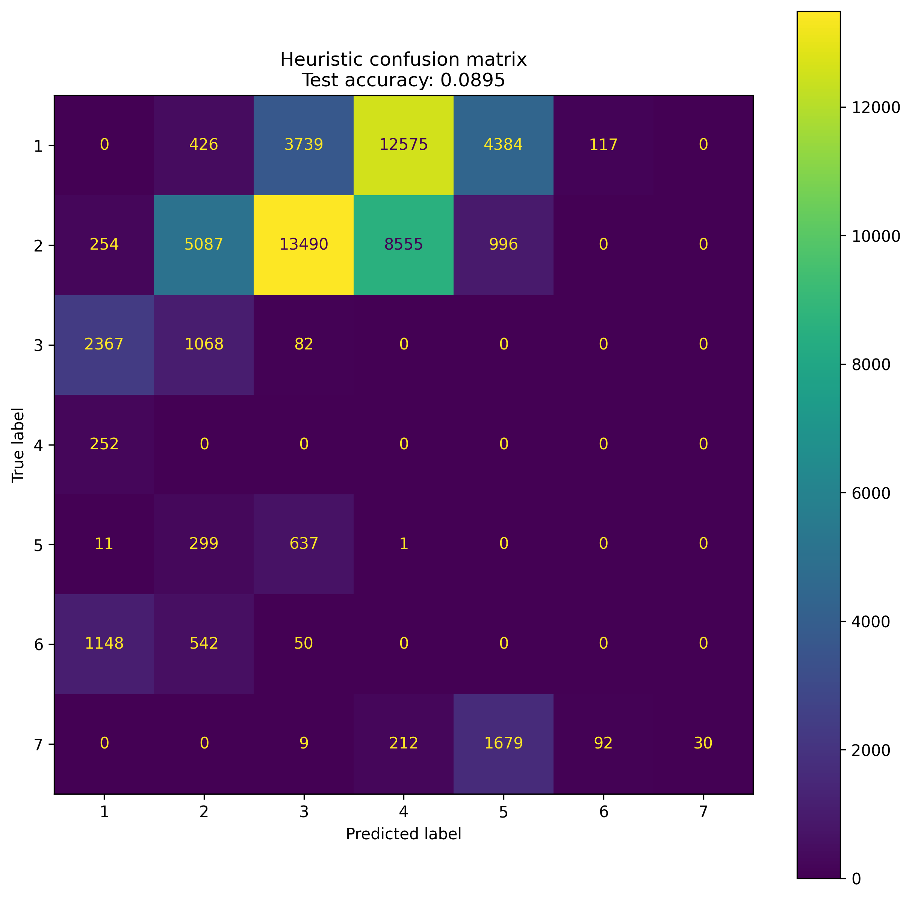
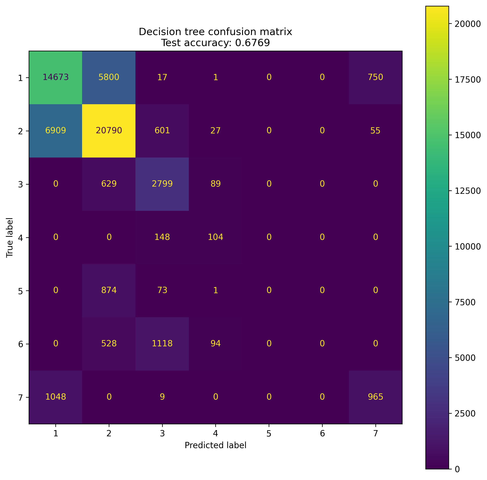
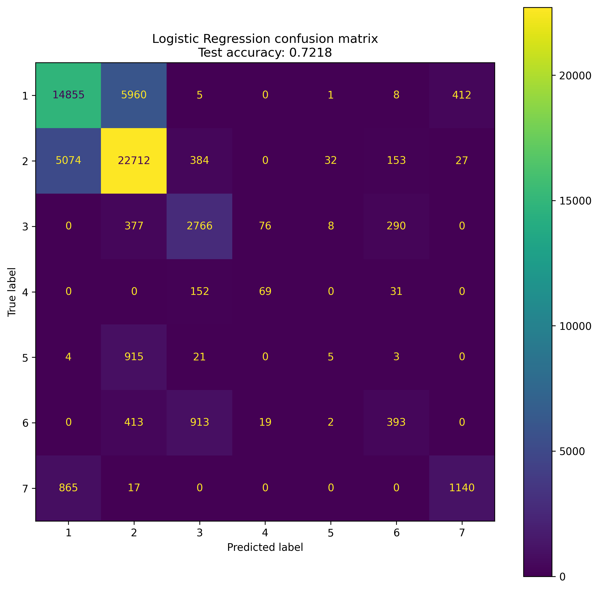
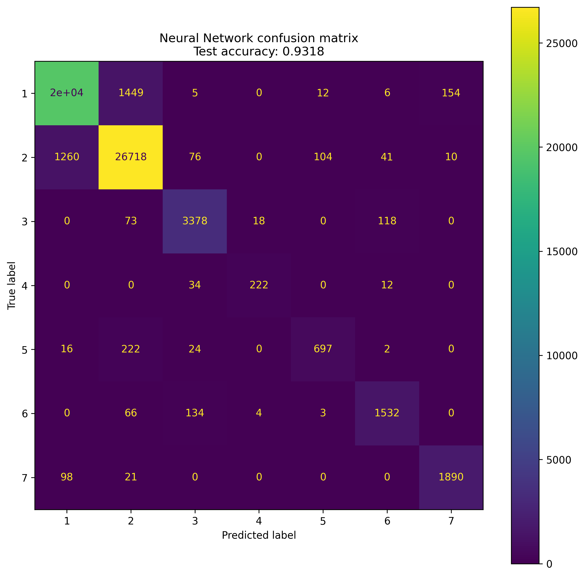
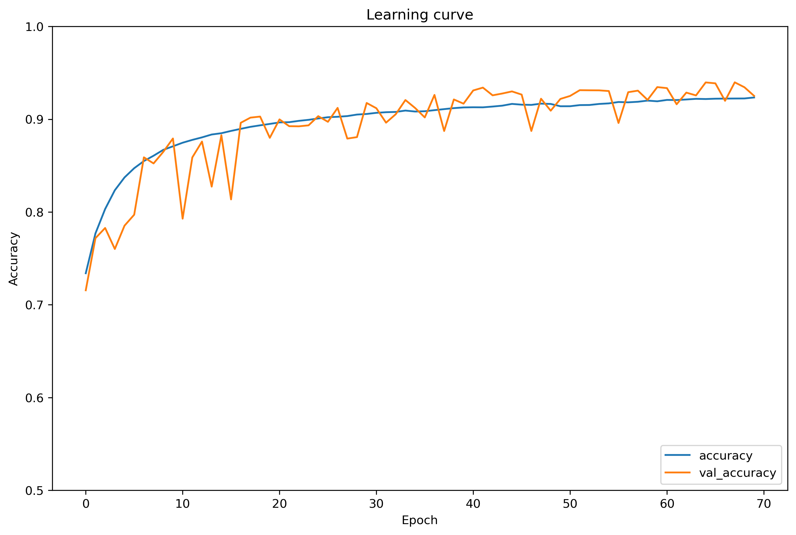

## OpenX Internship Assignment

### Assignment summary
1. Load the Covertype Data Set from the UCI Machine Learning Repository.

2. Implement a simple heuristic for classifying the data.

3. Train two baseline machine learning models using the Scikit-learn library.

4. Train a neural network using the TensorFlow library, and create a function to find the best set of hyperparameters.

5. Evaluate the performance of the heuristic, baseline models, and neural network, and choose appropriate metrics and plots for comparison.

6. Create a REST API that serves the trained models and allows users to choose a model and input features for prediction.

### Installation

Make sure to have the latest pip version installed.

```bash
pip install --upgrade pip
```

```bash 
pip install -r requirements.txt 
```

### Usage

```bash
python main.py 
```

```bash
curl -X POST -H "Content-Type: application/json" -d '{"model": "neural_network", "features": [2804,139,9,268,65,3180,234,238,135,6121,1,0,0,0,0,0,0,0,0,0,0,0,0,0,0,1,0,0,0,0,0,0,0,0,0,0,0,0,0,0,0,0,0,0,0,0,0,0,0,0,0,0,0,0]}' http://localhost:5000/predict
```

Where the model can be one of the following: `heuristic`, `tree`, `neural_network`, `logistic_regression`.

## Evaluation

- ### Heuristic

     The heuristic model is a simple model that predicts the most common class in the training set. The accuracy of the model is 9%.
     

     As we can see performance of the heuristic model is very bad.
     We could get almost 50% accuracy by simply predicting the most common class in the training set, because the majority of the classes are of type 2.


- ### Tree

     The tree model is a decision tree classifier with a maximum depth of 3. The accuracy of the model is 68%.
     

- ### Logistic Regression

     The logistic regression model is a logistic regression classifier with a maximum number of iterations of 100. The accuracy of the model is 72%.
     

    
- ### Neural Network
    
    The neural network model is a neural network classifier with a maximum number of iterations of 100. The accuracy of the model is 93%.
     
    
    The best set of hyperparameters for the neural network model is:

    | Dropout | Activation | Kernel Initializer | Learning Rate | Batch Size |
    |---------|------------|--------------------|---------------|------------|
    | 0.2     | relu       | lecun_uniform      | 0.005         | 512        |

    Learning curves for the neural network model with the best set of hyperparameters:
    

    As we can see, the neural network learns relatively fast and the validation accuracy is starting to flatten out. Validation accuaracy is very close to the training accuracy, which means that the model is not overfitting. The model is not underfitting either, because the training accuracy is high, I suppose we could train this model for more epochs and get even better results.
